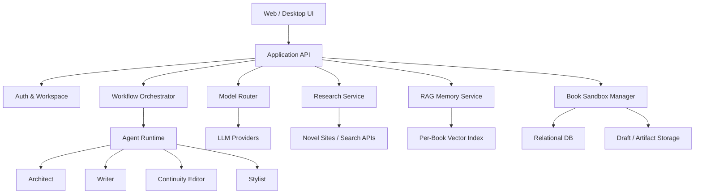
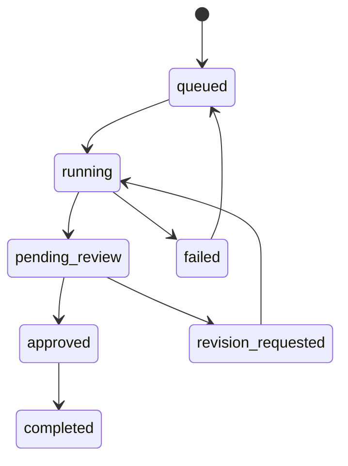

# 智能体小说创作系统需求与技术规格

## 1. 产品目标

Novel-Agent System 是一个面向长篇小说创作的多智能体协同平台。系统通过“素材检索 -> 宏观设定 -> 中观大纲 -> 微观生成 -> 审校润色”的分层工作流，把小说创作拆成可确认、可回滚、可审计的节点，并允许用户在任意节点插话修改。

核心目标：

- 支持多本小说并行创作，每本书拥有完全隔离的世界观、角色、章节、讨论记录、检索素材与向量索引。
- 支持多模型 API 路由，让不同 Agent 使用不同模型。
- 通过闸口机制实现 Human-in-the-Loop，每个关键产物必须经用户确认后才能进入下一阶段。
- 通过 RAG 与 Continuity Editor 审查降低长篇创作中的设定漂移、人物 OOC、战力崩坏和剧情断层。

## 2. 用户角色与核心场景

### 2.1 用户角色

- 作者：输入题材、梗、文风样本、修订意见，确认或驳回系统产物。
- 系统管理员：配置模型供应商、API Key、默认 Agent 模型路由、检索源与安全策略。
- 创作 Agent：由系统调度，包括总策划、主笔、逻辑判官、润色剪辑。

### 2.2 核心场景

1. 用户创建一本新书，输入题材、主角设想、目标读者和期望篇幅。
2. 系统检索同类热门作品的结构化信息，生成风向分析与避雷清单。
3. 用户输入文风样本，系统生成 Style Prompt。
4. Architect 生成世界观白皮书和人物卡，等待用户确认。
5. Architect 生成分卷大纲和章节大纲，逐级等待用户确认。
6. Writer 按章节大纲生成正文。
7. Continuity Editor 检查正文与设定、人物卡、历史剧情快照是否冲突。
8. Stylist 润色正文，系统生成章节快照并写入记忆库。
9. 用户确认章节后，系统推进下一章。

## 3. 系统边界

### 3.1 必须支持

- 多模型供应商与模型路由。
- 多书籍 CRUD 与沙盒隔离。
- 工作流闸口与用户确认。
- 结构化创作资产管理。
- 同类题材检索与结构化摘要。
- Few-Shot 文风分析与 Style Prompt 生成。
- 多 Agent 工作群聊式协作。
- 章节级 RAG 检索与连续性审查。

### 3.2 明确不做

- 不抓取或复刻整本受版权保护的小说正文。
- 不把用户提供的作家样本文本直接拼接成可替代原作者的长段仿写语料。
- 不允许跨书籍共享私有世界观、人物卡、章节正文或向量索引，除非用户显式导出/导入。

## 4. 架构总览



推荐实现：

- 前端：React / Next.js，提供书籍切换、资产编辑器、章节工作台、Agent 群聊、闸口确认。
- 后端：Python FastAPI 或 Node.js NestJS，负责工作流编排、模型路由、沙盒隔离、任务队列。
- 数据库：PostgreSQL 保存结构化资产；对象存储保存长文本版本；向量库可用 pgvector、Qdrant 或 LanceDB。
- 队列：Redis Queue / Celery / BullMQ，用于长任务、检索、生成、审校。

## 5. 模块设计

### 5.1 多模型 API 路由管理

能力：

- 配置多个供应商：OpenAI、Anthropic、Google、DeepSeek、通义、智谱、本地模型等。
- 每个 Agent 可绑定默认模型、备用模型、温度、最大输出、超时与重试策略。
- 每个任务可覆盖默认路由，例如“正文生成用高上下文模型，逻辑审查用强推理模型”。
- 记录调用成本、延迟、错误率与 token 用量。

核心实体：

```json
{
  "provider_id": "openai-main",
  "display_name": "OpenAI Main",
  "base_url": "https://api.openai.com/v1",
  "api_key_ref": "vault://openai-main",
  "models": [
    {
      "model_id": "gpt-5",
      "capabilities": ["reasoning", "long_context", "tool_use"],
      "default_temperature": 0.7
    }
  ]
}
```

Agent 路由：

```json
{
  "agent_role": "Writer",
  "primary_model": "provider:model",
  "fallback_models": ["provider:model-lite"],
  "settings": {
    "temperature": 0.85,
    "max_output_tokens": 12000
  }
}
```

### 5.2 多书籍沙盒隔离

每本书的所有数据必须带 `book_id`，并在服务层、数据库层、向量索引层同时隔离。

隔离范围：

- 世界观白皮书。
- 人物卡。
- 风格指南。
- 检索素材与风向报告。
- 分卷大纲、章节大纲。
- 章节正文与版本历史。
- 章节动态剧情快照。
- Agent 讨论记录。
- 向量索引命名空间。

建议的向量命名空间：

```text
book:{book_id}:world
book:{book_id}:characters
book:{book_id}:chapters
book:{book_id}:research
book:{book_id}:agent_logs
```

### 5.3 Human-in-the-Loop 闸口机制

每个核心产物都进入 `pending_review` 状态，用户必须确认或修改。

状态机：



闸口类型：

- `research_report_gate`：风向分析确认。
- `style_guide_gate`：文风指导确认。
- `world_bible_gate`：世界观白皮书确认。
- `character_cards_gate`：人物卡确认。
- `volume_outline_gate`：分卷大纲确认。
- `chapter_outline_gate`：章节大纲确认。
- `chapter_draft_gate`：章节正文确认。
- `chapter_polish_gate`：润色终稿确认。

用户插话规则：

- 任意任务运行中收到用户修改指令时，任务可被标记为 `interrupted`。
- 系统保存当前输出片段和 Agent 讨论记录。
- Orchestrator 将用户修改转化为 `revision_request`，重新调度相关 Agent。
- 已确认产物不被静默覆盖，必须生成新版本。

## 6. 创作工作流

### 6.1 阶段一：素材检索与风向锚定

输入：

- 题材、核心梗、目标读者、平台偏好、避雷要求。

输出：

- 热门作品结构化摘要。
- 标签与高频词统计。
- 爽点地图。
- 读者避雷点。
- 差异化切入建议。

检索限制：

- 只抓取公开简介、标签、榜单信息、评论摘要等结构化或短文本信息。
- 不抓取整本正文。
- 对用户样本文本仅分析风格特征，不输出可替代原文的长段文本。

风向报告结构：

```json
{
  "genre": "玄幻升级流",
  "hot_tags": ["废柴逆袭", "宗门", "系统", "快节奏"],
  "reader_rewards": [
    "主角连续破局",
    "低位身份反杀高位角色",
    "明确战力等级带来的成长反馈"
  ],
  "reader_risks": [
    "升级过快导致战力崩坏",
    "配角工具人化",
    "长时间无主线推进"
  ],
  "differentiation": [
    "把系统能力限制为代价型资源，避免无脑碾压"
  ]
}
```

### 6.2 阶段二：宏观设定

世界观白皮书：

- 底层逻辑。
- 能力体系与战力等级。
- 地理、政体、组织、经济与社会背景。
- 主要矛盾。
- 禁忌、代价、资源约束。
- 风格与基调。

人物卡：

- 基本信息。
- 外貌与识别特征。
- 核心动机。
- 内在恐惧。
- 误信念。
- 人物弧光。
- 与其他角色的关系。
- 口癖、行为习惯、价值观底线。
- 当前状态与随章节变化的动态字段。

### 6.3 阶段三：中观结构大纲

宏观时间线：

- 可选三幕式、英雄旅程、起承转合、网文升级循环。
- 将长期目标拆成分卷目标、阶段任务和关键反转。

章节大纲强制字段：

```json
{
  "chapter_no": 12,
  "title": "夜入藏经阁",
  "core_conflict": "主角必须在巡夜长老发现前取得残卷",
  "characters": ["林照", "沈青霜", "巡夜长老"],
  "mainline_goal": "获得修复灵脉的关键线索",
  "subplot_goal": "沈青霜开始怀疑主角真实来历",
  "emotional_turn": "从被迫冒险转为主动承担",
  "ending_hook": "残卷最后一页写着主角母亲的名字",
  "continuity_constraints": [
    "林照当前战力不能正面对抗巡夜长老",
    "沈青霜尚未知道系统存在"
  ]
}
```

### 6.4 阶段四：微观滚动渲染

章节生成前必须检索：

- 世界观白皮书。
- 相关人物卡。
- 当前章节大纲。
- 前序所有章节快照，优先最近 5 章。
- 与本章地点、组织、能力体系相关的检索片段。
- Style Prompt。

生成流程：

1. Architect 下发章节写作指令。
2. Memory Service 组装上下文包。
3. Writer 生成章节初稿。
4. Continuity Editor 输出审查报告。
5. 如存在严重问题，返回 Writer 重写。
6. Stylist 润色节奏、语言和错别字。
7. 用户确认后，系统生成章节快照并写入 RAG。

章节快照结构：

```json
{
  "chapter_no": 12,
  "summary": "林照潜入藏经阁取得残卷，发现残卷与母亲有关。",
  "plot_changes": [
    "林照获得残卷",
    "沈青霜开始怀疑林照隐藏秘密"
  ],
  "character_state_changes": [
    {
      "character": "林照",
      "change": "意识到母亲失踪可能与宗门禁地有关"
    }
  ],
  "new_facts": [
    "巡夜长老无法离开藏经阁三层以上区域",
    "残卷最后一页出现林照母亲姓名"
  ],
  "open_threads": [
    "残卷为何记录林照母亲",
    "沈青霜是否会追问系统异常"
  ]
}
```

## 7. 多 Agent 协作协议

### 7.1 Agent 职责

Architect：

- 制定宏观结构。
- 拆解任务。
- 输出世界观、分卷大纲、章节大纲。
- 给 Writer 下发具体写作指令。

Writer：

- 按 Style Prompt 与章节大纲生成正文。
- 不擅自新增破坏设定的能力、组织或角色关系。
- 对每段关键行动给出情绪、动作、环境三层渲染。

Continuity Editor：

- 对照世界观、人物卡、章节快照、当前大纲审查。
- 输出问题严重级别：`blocker`、`major`、`minor`。
- blocker 必须驳回。

Stylist：

- 修正错别字和病句。
- 精简冗余。
- 强化节奏、钩子、爽点或文学性。
- 不改变已确认设定和剧情事实。

### 7.2 群聊消息格式

```json
{
  "book_id": "book_001",
  "workflow_id": "wf_123",
  "agent_role": "ContinuityEditor",
  "message_type": "review",
  "content": "第 4 段中主角正面对抗巡夜长老，与当前战力约束冲突。",
  "references": [
    {
      "artifact_type": "character_card",
      "artifact_id": "char_linzhao",
      "field": "current_power_level"
    }
  ],
  "severity": "blocker"
}
```

### 7.3 Continuity 审查清单

- 战力等级是否越级且无代价。
- 人物动机是否与人物卡冲突。
- 已确认事实是否被改写。
- 时间线、地点、伤势、资源、物品是否连续。
- 是否提前泄露尚未揭示的信息。
- 是否新增未登记的关键设定。
- 章尾钩子是否承接主线或支线。

## 8. 数据模型草案

主要表：

- `users`
- `model_providers`
- `model_routes`
- `books`
- `book_sandboxes`
- `artifacts`
- `artifact_versions`
- `characters`
- `chapters`
- `chapter_versions`
- `chapter_snapshots`
- `research_sources`
- `research_reports`
- `style_guides`
- `workflow_runs`
- `workflow_steps`
- `gate_reviews`
- `agent_messages`
- `rag_documents`

核心字段：

```sql
CREATE TABLE books (
  id UUID PRIMARY KEY,
  owner_id UUID NOT NULL,
  title TEXT NOT NULL,
  genre TEXT,
  status TEXT NOT NULL,
  created_at TIMESTAMP NOT NULL,
  updated_at TIMESTAMP NOT NULL
);

CREATE TABLE artifacts (
  id UUID PRIMARY KEY,
  book_id UUID NOT NULL REFERENCES books(id),
  artifact_type TEXT NOT NULL,
  title TEXT NOT NULL,
  current_version_id UUID,
  status TEXT NOT NULL,
  created_at TIMESTAMP NOT NULL,
  updated_at TIMESTAMP NOT NULL
);

CREATE TABLE workflow_steps (
  id UUID PRIMARY KEY,
  workflow_run_id UUID NOT NULL,
  book_id UUID NOT NULL REFERENCES books(id),
  step_type TEXT NOT NULL,
  status TEXT NOT NULL,
  gate_type TEXT,
  output_artifact_id UUID,
  created_at TIMESTAMP NOT NULL,
  updated_at TIMESTAMP NOT NULL
);
```

## 9. API 草案

书籍：

- `POST /books`
- `GET /books`
- `GET /books/{book_id}`
- `PATCH /books/{book_id}`
- `DELETE /books/{book_id}`
- `POST /books/{book_id}/switch`

模型路由：

- `GET /model-providers`
- `POST /model-providers`
- `PATCH /model-providers/{provider_id}`
- `GET /agent-routes`
- `PATCH /agent-routes/{agent_role}`

工作流：

- `POST /books/{book_id}/workflows/research`
- `POST /books/{book_id}/workflows/style-guide`
- `POST /books/{book_id}/workflows/worldbuilding`
- `POST /books/{book_id}/workflows/outline`
- `POST /books/{book_id}/workflows/chapters/{chapter_no}/draft`
- `POST /workflow-steps/{step_id}/approve`
- `POST /workflow-steps/{step_id}/request-revision`
- `POST /workflow-steps/{step_id}/interrupt`

资产：

- `GET /books/{book_id}/artifacts`
- `GET /books/{book_id}/artifacts/{artifact_id}`
- `GET /books/{book_id}/chapters`
- `GET /books/{book_id}/chapters/{chapter_no}`
- `GET /books/{book_id}/agent-messages`

## 10. MVP 切分

### MVP 1：单机可用创作闭环

- 多书籍 CRUD。
- 每本书独立资产目录与数据库记录。
- 手动配置 1 到 2 个模型供应商。
- Architect / Writer / Continuity Editor / Stylist 四 Agent 基础调度。
- 世界观、人物卡、章节大纲、正文生成。
- 闸口确认与版本历史。
- 章节快照写入。

### MVP 2：RAG 与连续性增强

- 接入向量库。
- 章节生成前自动检索上下文。
- Continuity Editor 引用证据审查。
- 章节快照自动结构化。
- Agent 群聊记录可视化。

### MVP 3：素材检索与文风分析

- 接入搜索 API 或合规爬取公开结构化信息。
- 生成风向报告。
- 输入样本文本生成 Style Prompt。
- 检索报告与文风指南进入闸口。

### MVP 4：生产化

- 成本统计。
- 队列与失败重试。
- 导入导出。
- 权限与团队协作。
- 监控、审计日志与备份。

## 11. 前端页面草案

- 书籍列表：创建、切换、删除、状态概览。
- 创作工作台：左侧资产树，中间产物编辑器，右侧 Agent 群聊与审查结果。
- 工作流看板：显示当前阶段、运行中任务、待确认闸口。
- 模型路由设置：供应商配置、Agent 模型分配、成本预估。
- 章节管理：章节大纲、草稿、终稿、快照、版本对比。
- 记忆库：世界观、人物卡、章节快照、检索素材的检索与引用视图。

## 12. 安全与合规

- API Key 必须进入密钥管理，不明文存储在数据库。
- 检索服务遵守目标站点 robots、服务条款与版权限制。
- 用户样本文本仅用于提取风格特征，不生成长段可替代原作的仿写。
- 所有生成内容保留版本与来源，便于用户审计。
- 删除书籍时必须二次确认，并清理对应向量命名空间。

## 13. 质量指标

- 每章生成前上下文包必须包含至少：世界观、相关人物卡、当前章节大纲、最近章节快照。
- Continuity Editor 对 blocker 问题的拦截率应优先于生成速度。
- 所有闸口产物必须可版本回溯。
- 跨书籍查询不得返回其他书籍数据。
- 每次模型调用必须记录模型、Agent、token、耗时、成本估算与错误信息。

## 14. 待确认问题

- 首个版本优先做 Web App、桌面 App、CLI，还是 API 服务？
- 是否需要多人协作与权限系统？
- 目标平台偏向网文爽文、严肃文学、轻小说，还是多模式？
- 是否需要内置中文小说网站检索源，或先接通用搜索 API？
- 用户是否希望保留完整 Agent 群聊，还是只保留摘要与审查意见？

